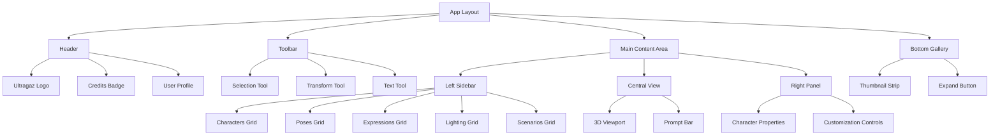

# Ultragaz Character Generation Studio - Architecture

## Layout Structure



## Component Hierarchy

```
src/
├── app/
│   ├── layout.tsx (main layout with header)
│   ├── page.tsx (character studio main page)
│   └── api/
│       └── character/
│           └── generate/route.ts
├── components/
│   ├── studio/
│   │   ├── header.tsx
│   │   ├── toolbar.tsx
│   │   ├── left-sidebar.tsx
│   │   ├── viewport.tsx
│   │   ├── prompt-bar.tsx
│   │   ├── properties-panel.tsx
│   │   └── gallery.tsx
│   └── ui/ (existing shadcn components)
└── lib/
    ├── character-data.ts
    └── credits.ts
```

## Data Flow

```mermaid
sequenceDiagram
    participant User
    participant UI
    participant API
    participant Database
    
    User->>UI: Enter prompt
    UI->>API: Generate character request
    API->>Database: Check credits
    Database-->>API: Credits available
    API->>API: Generate character
    API->>Database: Deduct credits
    API-->>UI: Return character
    UI-->>User: Display character